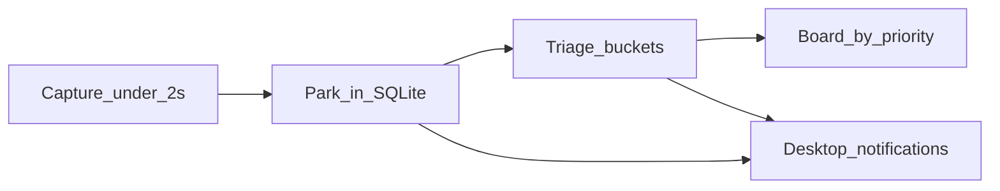
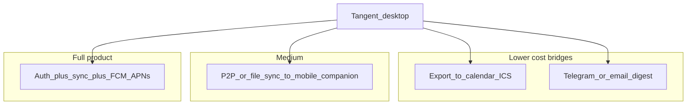
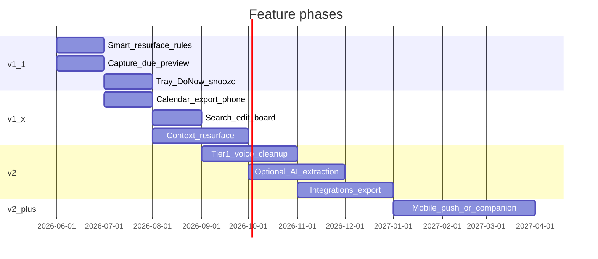

# 10 - Market, Demand, and Feature Strategy

Working codename: **Tangent**
Date: 2026-06-02
Related docs: [01-user-research.md](../../docs/01-user-research.md), [02-competitor-teardown.md](../../docs/02-competitor-teardown.md), [06-mvp-spec.md](../../docs/06-mvp-spec.md), [07-market-assessment.md](../../docs/07-market-assessment.md)

## Roadmap status

| Item | Phase | Status |
| --- | --- | --- |
| Lead-time resurfacing, capture due preview, triage due-soon suggestions | v1.1 | Pending |
| Calendar/ICS export or ntfy for phone alerts | v1.x | Pending |
| Optional async AI datetime/urgency extraction + daily digest | v2 | Pending |
| Resurface when user returns to same app/file context | v1.x–v2 | Pending |
| Signed build, demo GIF, community launch | Distribution | Pending |

---

## What you have today (and why it already beats most options)

Tangent is **not** competing in the crowded "speak instead of type" lane. The shipped app already implements the wedge from [07-market-assessment.md](../../docs/07-market-assessment.md) and [02-competitor-teardown.md](../../docs/02-competitor-teardown.md):

| Dimension | Wispr / VoxCore / Yapex | Notchd / tickk / Saner.ai | **Tangent (now)** |
| --- | --- | --- | --- |
| Job | Paste clean text into current app | Capture or organize, often mobile/web | **Park tangents without leaving flow** |
| Capture | Fast dictation | Slower or app-focused | **Global hotkey, hold-to-talk, auto-save** |
| Work context | None (Wispr: controversial screenshots) | None | **Active app + window + parsed file/workspace** |
| Loop | No inbox/triage | Partial | **Triage + Board + buckets** |
| Privacy | Cloud-heavy (Wispr) | Mixed | **Local SQLite, optional on-device voice** |
| Footprint | Heavy (~800MB class) | Browser/web weight | **Tauri, lazy voice** |

**How you win in one sentence:** When developers get interrupted, they hunt for context — Tangent stores it at capture time and runs the park → triage → resurface loop. See [../../docs/11-strategic-assessment-2026.md](../../docs/11-strategic-assessment-2026.md).

**Retention risk (still #1):** If users capture but never triage, the inbox becomes a graveyard. Every feature below should reinforce "pipeline, not graveyard."

---

## Market and demand (honest read)

**Demand is real and growing**
- Large adjacent markets: productivity software, note-taking, AI speech-to-text, ADHD-focused apps (double-digit CAGR).
- **Wispr Flow** proves willingness to pay for voice productivity (~19–20% conversion, strong retention)—but they own **dictation**, not your job.
- **2025–2026 wave** of capture/ADHD products (Notchd, tickk, Saner.ai, BrainDump, etc.) = validated pain, **crowded attention**.

**Your realistic beachhead (SOM)**
- English-speaking **desktop knowledge workers** who context-switch heavily: developers, students, ADHD-adjacent adults.
- Reach via communities (HN, Reddit r/ADHD, r/productivity, dev Twitter)—demo in 30 seconds (hotkey + context chip).
- Strong indie outcome: tens of thousands of active users, thousands paying at **$5–8/mo or ~$60/yr** (benchmarks in doc 07).

**Do not compete on**
- Dictation quality alone (Google Gboard Rambler, Apple, Wispr, local Whisper clones).
- Full AI organizer surfaces (Saner.ai pulls you out of flow).
- "Another notes app."

**Compete on**
- **Loop + work context + lightweight + private**, with voice/cleanup as accelerators.

**Persona fit for key feature ideas**
- **Student (Persona B):** Smart deadlines and phone alerts are high emotional value ("assignment due tomorrow morning").
- **Developer (Persona A):** Context wedge + tray + low friction matter more than phone until they leave the desk.
- **ADHD-adjacent (Persona C):** Resurfacing + guilt-free Drop + nudges; sensitive to notification spam.

---

## Feature ideas — evaluation

### 1. Smart alert for deadlines (e.g. "assignment due tomorrow morning" → sort + notify)

**Already partially built**
- [`src/lib/parse.ts`](../src/lib/parse.ts): `chrono-node` extracts `due_at` from phrases like "tomorrow", "Friday", "in 2 days".
- [`src/lib/resurface.ts`](../src/lib/resurface.ts) + [`src/lib/db.ts`](../src/lib/db.ts): desktop notifications when `due_at` or `resurface_at` is due; daily "N parked thoughts" nudge; `resurfaceHour` in Settings.

**Gaps vs. "smart" (high differentiation potential)**
- **Scheduling intelligence:** "Tomorrow morning" may fire at midnight or a single parsed instant—not "evening before" or "1 hour before class." Users expect *lead time*, not exact due instant only.
- **Auto-priority at capture:** No rule yet like "due within 24h → suggest Do Soon" or auto-sort; user still triages manually.
- **Notification content:** Generic title/body; could include context chip ("VS Code — assignment3.py") and suggested action.
- **While app closed:** Tauri notifications only run if the desktop app/process is alive (tray). True "smart alert" when laptop asleep/closed needs phone or OS calendar (see #3).

**Recommendation:** Treat this as **v1.1 core moat**, not v2. Ship in layers:
1. **Rules (no AI):** Lead-time presets (evening before / morning-of / 1h before); map "morning/afternoon/evening" to user timezone + `resurfaceHour`; show due chip in capture HUD before save.
2. **Triage assist:** At triage, badge "due soon" and one-key accept suggested bucket (Do Soon).
3. **Optional AI later** for messy voice (see #2).

This directly serves JTBD #3 in [01-user-research.md](../../docs/01-user-research.md): *"When something is time-sensitive, I want it to come back at the right moment."*

---

### 2. Where is AI worth it (especially for smart alerts)?

**Use AI where rules fail or cost of wrong date is high—not everywhere.**

| Use case | Rules / chrono | AI (local Tier 1 or BYOK Tier 2) | Verdict |
| --- | --- | --- | --- |
| "Due tomorrow morning" from clean text | Good | Overkill | **Rules first** |
| Messy voice: "uh assignment due tmrw like before noon" | Weak | Strong | **AI worth it** |
| Self-correction in transcript | Tier 0 rules | Tier 1 LLM ([06-mvp-spec.md](../../docs/06-mvp-spec.md)) | **Optional polish** |
| Suggest bucket at triage | Keywords ("buy", "email") | LLM summary | **Rules + light heuristics first** |
| Cluster 12 parked thoughts into themes | Poor | Strong | **Pro / v2 differentiator** |
| Generic chat assistant | N/A | Competes with Siri/ChatGPT | **Avoid** |

**Best AI ROI for Tangent (aligned with positioning)**
1. **Post-capture extraction (async):** datetime + urgency + one-line "action" from raw voice—never blocks capture; show in triage as editable chips.
2. **Faithful cleanup** (already spec'd): fix filler and "no wait, oat milk" without changing meaning—matches Wispr expectation but on-device.
3. **Daily digest:** "3 things due soon, 2 from same project (auth.py context)"—reinforces pipeline without opening a heavy organizer.

**What to avoid**
- AI that forces decisions at capture time (violates principle #2 in [06-mvp-spec.md](../../docs/06-mvp-spec.md)).
- Cloud-by-default for alerts (privacy backlash pattern from Wispr).

**Monetization fit:** Free = rules + chrono alerts; Pro = on-device smart extraction + clustering + BYOK best cleanup ([07-market-assessment.md](../../docs/07-market-assessment.md) section 6).

---

### 3. Phone notifications when laptop app is closed

**High user value, high engineering cost—not in MVP for good reason.**

Current architecture: **local-only SQLite, no account, no sync service.** Desktop notifications require the Tangent process (typically tray) to be running.

**Options (increasing complexity)**

| Approach | Pros | Cons |
| --- | --- | --- |
| **Calendar export (ICS) / Google Cal one-way** | Phone alerts via OS calendar; no mobile app | User setup friction; not thought-native |
| **Push gateway (Telegram bot, ntfy.sh)** | Real phone push, minimal mobile UI | Third-party; privacy story weaker |
| **Companion app + sync** | Best UX; matches Notchd on phone | Build iOS/Android + sync protocol + conflict resolution |
| **Cloud backend + FCM/APNs** | Reliable when laptop off | Accounts, hosting cost, privacy shift |

**Recommendation**
- **Near term:** Calendar/.ics export for items with `due_at` + "add to calendar" action on triage—gets phone alerts **without** building a mobile app.
- **Medium term:** Optional **ntfy** or Telegram for power users who want push without full sync.
- **Long term (Pro):** Encrypted sync + lightweight mobile **capture-only** companion (capture on phone, triage on desktop)—extends wedge rather than duplicating Notchd's phone-first story.

This is the right feature for **students leaving the desk** but should not block shipping desktop polish and GitHub distribution.

---

## Additional recommendations (prioritized)

### Tier A — Deepen the wedge (do before phone app)

1. **Smarter resurfacing schedule** — Lead times, snooze from notification, "morning of" vs "night before"; actionable notification body with context.
2. **Capture-time preview** — Show parsed due date and urgency on HUD before save (builds trust in smart alerts).
3. **Triage speed** — Auto-suggest bucket for due-soon items; keyboard "accept suggestion"; weekly review mode (5 parked → clear).
4. **Do Now tray strip** — Pin top 3 "Do Now" in tray menu ([06-mvp-spec.md](../../docs/06-mvp-spec.md) should-have)—visible value without opening full UI.
5. **Search + edit on Board** — Reduces graveyard fear; edit due date inline.
6. **Whisper model cache + max record duration** — QoL; keeps "hold hotkey" magic from feeling sluggish.

### Tier B — Moat vs. tickk / Saner / Notchd

7. **Context-powered resurfacing** — "You're back in VS Code on `auth.py` — you parked 2 thoughts here yesterday."
8. **Integrations (export only first)** — Todoist / Notion / Calendar one-way push for triaged "Do Now" items.
9. **IDE/browser extension** — Exact file path + URL in `ctx_extra` (harder for competitors to copy without desktop agent).
10. **Tier 1 on-device cleanup** — Wispr-like self-correction without cloud; async after capture.
11. **Mental load digest** — Daily notification: "4 due soon, 7 parked, 2 in same project."

### Tier C — Growth and distribution

12. **Signed Windows build + bundled Whisper model** — Removes SAC friction for strangers.
13. **30-second demo GIF** — Hotkey → context chip → triage → notification; defeats "isn't this Siri/Notes?"
14. **macOS build** — Expands SAM; Superwhisper users are dictation-first but overlap on privacy.

### Tier D — De-prioritize for now

- Full team/collab, rich docs, always-on listening, cloud-required accounts.
- Competing as a general AI assistant.

---

## Suggested roadmap

---

## Bottom line

- **Market:** Large, emotional, proven—but noisy. Your odds are best in the **desktop capture → park → triage → resurface** lane with **work context**, not dictation.
- **Your three ideas:** All directionally correct. **Smart deadlines** are the highest leverage *next* feature and mostly achievable with **rules + better scheduling** before heavy AI. **AI** should focus on messy voice extraction and digest/clustering, not chat. **Phone alerts** matter most for students; start with **calendar/export/push bridges**, not a full mobile app.
- **Strongest extra bets:** Context-aware resurfacing, triage ritual improvements (suggestions, weekly review), tray Do Now, integrations export, then optional on-device cleanup.
